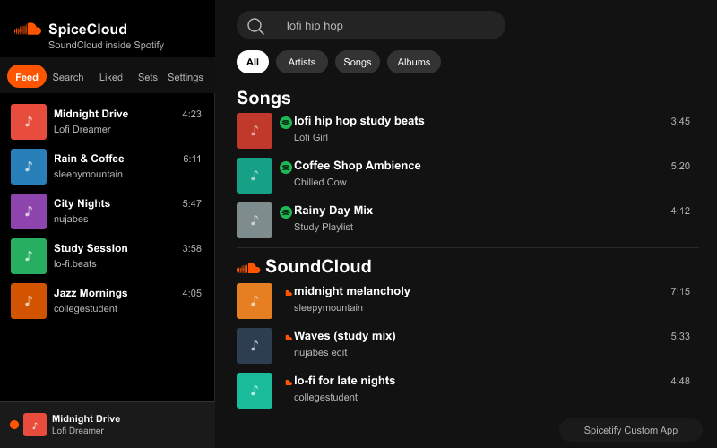

# SpiceCloud

> SoundCloud inside Spotify — a [Spicetify](https://spicetify.app) custom app that brings full SoundCloud playback, search, and browsing into Spotify's desktop client.




---

## Features

|                     |                                                                                                                                               |
| ------------------- | --------------------------------------------------------------------------------------------------------------------------------------------- |
| **Full playback**   | Play any SoundCloud track through Spotify's native now-playing bar — title, artist, artwork, progress bar, volume, and skip controls all work |
| **Search dropdown** | SoundCloud results appear directly in Spotify's search dropdown as you type, interleaved with Spotify results                                 |
| **Search page**     | A dedicated SoundCloud section is injected into Spotify's full search results page, using native Spotify row styling                          |
| **Feed**            | Browse your SoundCloud stream exactly as it appears on soundcloud.com                                                                         |
| **Liked tracks**    | Your SoundCloud likes displayed in Spotify's UI with like/unlike support                                                                      |
| **Playlists**       | Browse and play your SoundCloud sets                                                                                                          |
| **Source badge**    | Subtle orange SC indicator appears when a SoundCloud track is playing                                                                         |
| **Auto client_id**  | No API key setup needed — the `client_id` is extracted automatically from SoundCloud's own bundles and refreshed silently                     |

---

## Installation

### Via Spicetify Marketplace _(easiest)_

1. Open Spotify with Spicetify installed
2. Open the Marketplace tab in the sidebar
3. Search for **SpiceCloud** and click Install

### Manual

```bash
# 1. Clone the repo
git clone https://github.com/5djr/SpiceCloud.git
cd SpiceCloud

# 2. Install and build
npm install
npm run build

# 3. Register with Spicetify (run once)
spicetify config custom_apps spicecloud
spicetify apply
```

**Requirements:** [Spotify desktop](https://www.spotify.com/download) · [Spicetify](https://spicetify.app/docs/getting-started) v2+ · Node.js 18+

---

## Setup

SpiceCloud does not require a registered SoundCloud developer app. You authenticate with your own session token:

1. Open [soundcloud.com](https://soundcloud.com) in your browser while logged in
2. Open **DevTools → Network tab** and filter requests by `api-v2.soundcloud.com`
3. Click any request and copy the `Authorization` header value — it looks like `OAuth 2-123456-...`
4. Open the **SpiceCloud** panel inside Spotify, paste the token, and click Connect

The `client_id` is extracted and cached automatically. Both values persist in `Spicetify.LocalStorage` and refresh when they expire.

---

## Development

```bash
npm run watch    # rebuild on save
npm run start    # build + apply to Spicetify in one step
npm run preview  # regenerate preview.png from preview.svg
```

### Architecture

```
src/
├── app.tsx                        root component — 5-tab routing (Feed/Search/Liked/Sets/Settings)
├── extensions/
│   └── extension.tsx              startup extension — boots player + search integrations at launch
├── services/
│   ├── player.ts                  SoundCloudPlayer singleton — <audio>, now-playing bar, Spotify hooks
│   ├── api.ts                     SoundCloud API v2 wrapper (scFetch, search, stream, feed, likes)
│   ├── auth.ts                    OAuth token + client_id extraction → LocalStorage
│   ├── searchIntegration.ts       Injects SC rows into Spotify's search dropdown (#search-dropdown)
│   └── searchPageIntegration.ts   Injects SC section into Spotify's full search results page (#searchPage)
├── hooks/
│   ├── usePlayer.ts               React hook — subscribes to player singleton state
│   ├── useAuth.ts                 React hook — auth state and connect/disconnect
│   └── useLikedTracks.ts          React hook — liked track IDs, toggle with optimistic update
└── types/
    ├── soundcloud.ts              SCTrack, SCPlaylist, SCSettings, etc.
    └── spicetify.d.ts             Spicetify global type shims
```

### How playback works

The now-playing bar is never mutated with `textContent` (which crashes React's reconciliation). Instead, `data-sc-title` / `data-sc-artist` attributes are set on DOM elements and CSS `::before` overlays render the SoundCloud values on top, transparently to Spotify.

```
useAuth  ──►  auth.ts  (OAuth + client_id → LocalStorage)

usePlayer ──►  player.ts  (singleton)
                ├── <audio id="spicecloud-audio">  hidden in document.body
                ├── api.ts → /tracks/{id}/streams → http_mp3_128_url
                └── Spicetify.Player events (songchange, onplaypause, seek)
                     └── now-playing bar updated via CSS data-attribute overlays
```

### Search integration

Both search integrations boot from `extension.tsx` at Spotify startup and are tied to credential availability — they activate the moment you connect and stop if you disconnect, without requiring a Spotify restart.

- **Dropdown** (`searchIntegration.ts`) — MutationObserver watches for `#search-dropdown` (a React portal on `document.body`), then interleaves SC rows after Spotify's native results.
- **Search page** (`searchPageIntegration.ts`) — Uses `Spicetify.Platform.History.listen()` for SPA navigation detection with a 500 ms poll fallback; injects a full SoundCloud section using Spotify's own `main-trackList-*` CSS classes so the rows are visually identical to native tracks.

---

## Limitations

- Requires a valid SoundCloud OAuth token — there is no in-app browser login flow inside Spotify's Electron shell
- The OAuth token must be refreshed manually when it expires (typically every few weeks)
- Lyrics, shuffle, repeat, queue, Connect to device, mini-player, and fullscreen are Spotify-only features and are hidden during SoundCloud playback

---

## License

MIT — see [LICENSE](LICENSE)
